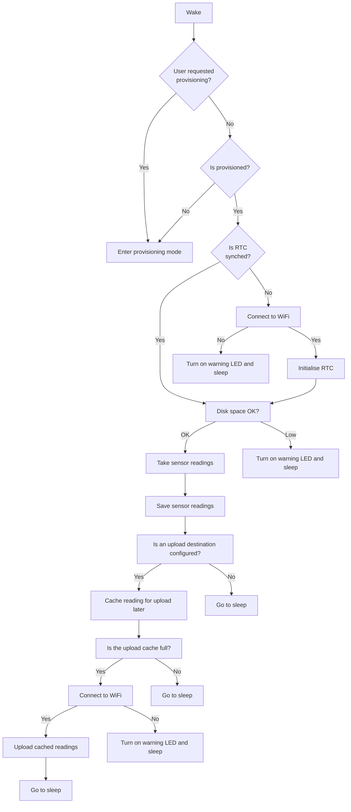

# Enviro MicroPython firmware

Our Enviro range of boards offer a wide array of environmental sensing and data logging functionality. They are designed to be setup in location for months at a time and take regular measurements.

On top of their individual features the boards all share a common set of functionality:

- on-board PicoW with RP2040 MCU and WiFi functionality
- accurate real-time clock (RTC) to maintain the time between boots
- a collection of wake event triggers (user button, RTC, external trigger)
- battery power input suitable for 1.8-5.5V input (ideal for 2x or 3x alkaline/NiMH cells or a single cell LiPo)
- reset button for frictionless debugging
- user button to trigger wake events or enter provisioning mode
- activity and warn LEDs to show current status
- Qw/ST connector to allow you to customise your sensor suite

These common features are mostly aimed at ensuring the modules can run off very little power for long periods of time. During sleep (when the RTC remains active) the boards only consume a few microamps of power meaning they can last for months on a small battery pack. The modules wake up at regular intervales (or on a fixed schedule) to take a reading, store it, and go back to sleep.

As well as logging data locally the modules can also (if they have access to a wireless network) upload the data they capture to a service like Adafruit.io. Wireless communications takes a lot of power so this should be done as infrequently as possible.

## Provisioning

On first boot you must provision your module. You may optionally supply a wireless network SSID and password for uploading data and select the type of module.

## Troubleshooting

Do not despair! While setting up Enviro is easy if you get every answer right first time it is quite easy to get into a situation where something in your configuration isn't quite right and it's hard to pin down exactly what it is.

### Step 1. Try the provisioning process again
It's possible we just made an error entering our details, if you put the Enviro back into provisioning mode then it will show you all of the values you previously supplied and allow you to check and edit them if necessary.

### Step 2. Look at the `config.py` file on the device

## Tips if you want to modify the code

### Code structure

### Boot up process

The Enviro boot up process is relatively complex as we need to ensure that things like the real time clock are synchronised and our wireless connection is functional before we attemp to take any readings.

