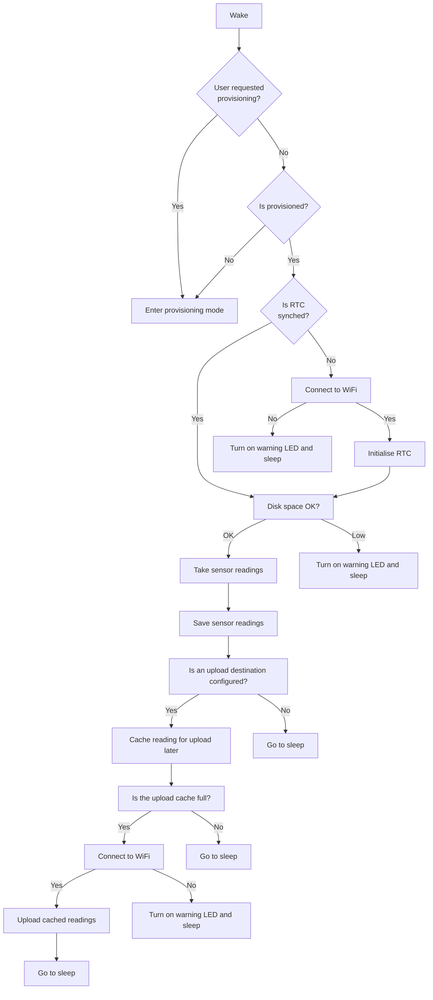

## Tips if you want to modify the code

### Code structure

### Boot up process

The Enviro boot up process is relatively complex as we need to ensure that things like the real time clock are synchronised and our wireless connection is functional before we attempt to take any readings.

### PIO watchdog

Issues relating to hardware hangs have been corrected by @julia767 adding in a PIO based watchdog timer that will remove the power and put the board back to deep sleep after a set period of time.  This can be set in the config.py in minutes.  In addition, it also sets the RTC Alarm to wake one minute after the watchdog time puts it to sleep.  In the normal execution where there are no hardware hangs the RTC alarm is overwritten with the normal alarm based on the reading frequency.  When setting the watchdog timer consider how long the device will need to run to upload many cached files in the event of Wifi or destination outage.  Testing to date (mqtt over ssl which is slow to upload) shows a watchdog time of 20 minutes will suffice to upload 100’s of cached readings but should be tuned to your own needs. 