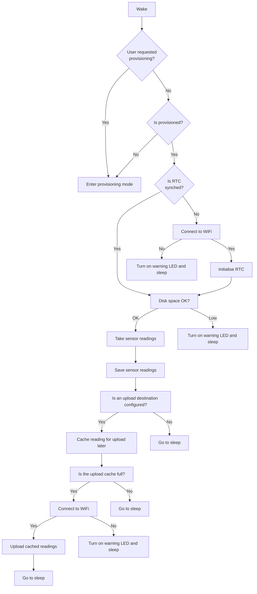

## Tips if you want to modify the code

### Code structure

### Boot up process

The Enviro boot up process is relatively complex as we need to ensure that things like the real time clock are synchronised and our wireless connection is functional before we attemp to take any readings.

