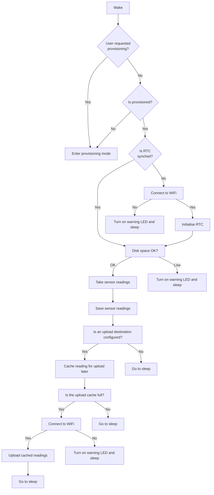

## Tips if you want to modify the code
### Adding data points to the returned readings
#### Simple data mangling
You can customise the sensor readings to be saved and uploaded by adjusting the "reading" dictionary; Adding extra information or removing data points that you don't want. Make any adustments after the line populating the reading dictionary:
```
reading = enviro.get_sensor_readings()
```

For example:
```
reading = enviro.get_sensor_readings()

del reading["temperature"]        # remove the temperature data
reading["custom"] = my_reading()  # add my custom reading value
```

#### Custom data points (BME688 example)
Add simple built in module calls in main.py after the reading dictionary is populated and modify the reading dictionary as required

Add your code after the line:
```
reading = enviro.get_sensor_readings()
```

A simple BME688 module example:
```
reading = enviro.get_sensor_readings()

from breakout_bme68x import BreakoutBME68X
bme = BreakoutBME68X(enviro.i2c)
temperature, pressure, humidity, gas_resistance, status, gas_index, meas_index = bme.read()
reading["temperature2"] = temperature
```
Credit: @hfg-gmuend in [#178](https://github.com/pimoroni/enviro/issues/178)
  
The above code will overwrite the returned data if you use the same key name e.g. "temperature", ensure this is what you want to do, or otherwise pick a unique name for your new data point e.g. "temperature2"

#### Adding a QW/ST globally supported module
You can add one or more module boards connected over the QW/ST connector and provide a global configuration for collecting and returning the data to the readings alongside the enviro board specific items.

##### Method (with examples)
Add a line in config_template.py in the appropriate section to allow users to enable that board and specify an address on the I2C bus.

Example:
```
# QW/ST modules
# These are modules supported out of the box, provide the I2C address if
# connected or otherwise leave as None
bme688_address = None
```

The template should have the address set to None, config files should be manually adjusted by the user to an address value after provisioning has completed for any boards connected.

Ensure your new configuration line has a default configuration in the config_defaults.py file to ensure firmware updates don't break older config files.

Example:
```
DEFAULT_BME688_ADDRESS = None

def add_missing_config_settings():
  # <...existing default value blocks...>

  try:
    config.bme688_address
  except AttributeError:
    warn_missing_config_setting("bme688_address")
    config.bme688_address = DEFAULT_BME688_ADDRESS
```

Create a new python module in the enviro/qwst_modules/ directory that defines how your custom board should collect and return data to the reading dictionary. The readings must be performed in a function called get_readings that takes positional arguments i2c and address. The return of this function must be an OrderedDict{} and should contain key value pairs of reading names to values, with reading names that are likely to be unique to this board to ensure they do not overwrite other readings on upload.

Example:

Create file enviro/qwst_modules/bme688.py containing:
```
from breakout_bme68x import BreakoutBME68X
from ucollections import OrderedDict
from phew import logging

def get_readings(i2c, address):
    bme688 = BreakoutBME68X(i2c)
    bme688_data = bme688.read()

    readings = OrderedDict({
        "temperature_bme688": round(bme688_data[0], 2),
        "humidity_bme688": round(bme688_data[2], 2),
        "pressure_bme688": round(bme688_data[1] / 100.0, 2),
        "gas_resistance_bme688": round(bme688_data[3], 2)
    })
    
    for reading in readings:
        name_and_value = reading + " : " + str(readings[reading])
        logging.info(f"  - {name_and_value}")    

    return readings
```

Modify the function qwst_boards() in enviro/\_\_init\_\_.py to include an entry for your new board. This should use an if statement to check the address from the config file is visible on the I2C bus, reference your new module file path from the section above in the import statement and append a dictionary that has keys for "name", "include" and "address" to the modules list. The include key has a value of your imported module and the address is the I2C address from the config file.

Example:
```
def get_qwst_modules():
  modules = []
  # <...existing module configurations...>

  if config.bme688_address in i2c_devices:
    import enviro.qwst_modules.bme688 as bme688
    modules.append({"name": "BME688", "include": bme688, "address": config.bme688_address})

  return modules
```

To complete this example, adjust your config.py to have bme688_address = 118 with a factory address BME688 board connected via the QW/ST connector.

#### Modifying specific board sensor collections
If the existing readings from a specific board require adjustment, for example adding a sea level adjusted value for atmospheric pressure readings. This should be done in the in board specific file in the boards directory, modifying the necessary lines in the get_sensor_readings() function.

### Code structure

### Boot up process

The Enviro boot up process is relatively complex as we need to ensure that things like the real time clock are synchronised and our wireless connection is functional before we attempt to take any readings.


