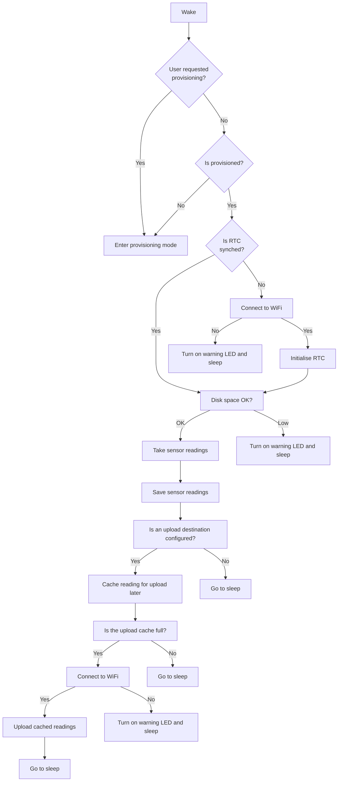

## Tips if you want to modify the code

### Code structure

### Boot up process

The Enviro boot up process is relatively complex as we need to ensure that things like the real time clock are synchronised and our wireless connection is functional before we attempt to take any readings.


```mermaid
  graph TD;
    provision[Enter provisioning mode]
    check_rtc{Is RTC<br>synched?}
    button_held{User requested<br>provisioning?}
    take_reading[Take sensor readings]
    set_rtc_from_ntp[Initialise RTC]
    connect_to_wifi_for_rtc[Connect to WiFi]
    connect_to_wifi_for_upload[Connect to WiFi]
    check_disk_space[Disk space OK?]
    save_reading[Save sensor readings]
    cache_for_upload[Cache reading for upload later]
    have_destination[Is an upload destination configured?]
    upload_cached_readings[Upload cached readings]
    need_uploading[Is the upload cache full?]
    sleep[Go to sleep]
    sleep2[Go to sleep]
    sleep3[Go to sleep]
    is_provisioned{Is provisioned?}
    wake[Wake]
    warning1[Turn on warning LED and sleep]
    warning2[Turn on warning LED and sleep]
    warning3[Turn on warning LED and sleep]

    wake-->button_held

    button_held-->|No|is_provisioned
    button_held-->|Yes|provision

    is_provisioned-->|Yes|check_rtc
    is_provisioned-->|No|provision

    check_rtc-->|Yes|check_disk_space
    check_rtc-->|No|connect_to_wifi_for_rtc

    connect_to_wifi_for_rtc-->|Yes|set_rtc_from_ntp-->check_disk_space
    connect_to_wifi_for_rtc-->|No|warning1

    check_disk_space-->|OK|take_reading
    check_disk_space-->|Low|warning2

    take_reading-->save_reading-->have_destination

    have_destination-->|Yes|cache_for_upload-->need_uploading

    need_uploading-->|Yes|connect_to_wifi_for_upload

    connect_to_wifi_for_upload-->|Yes|upload_cached_readings-->sleep2
    connect_to_wifi_for_upload-->|No|warning3

    need_uploading-->|No|sleep

    have_destination-->|No|sleep3

```

### Building the firmware

CI builds MicroPython from source, appends the Enviro Python files as a LittleFS
image, and publishes the results. `ci/micropython.sh` pins the MicroPython and
`pimoroni-pico` versions and holds all of the build steps; `board/` holds the
MicroPython board definition and the list of C modules to include.

To build locally you'll need `cmake`, `ccache`, `arm-none-eabi-gcc` and the
Python dependencies in `ci/requirements.txt`:

```
mkdir build && cd build
export CI_USE_ENV=1
export CI_PROJECT_ROOT=/path/to/enviro
export CI_BUILD_ROOT=$(pwd)
source $CI_PROJECT_ROOT/ci/micropython.sh
ci_prepare_all
ci_cmake_configure
ci_cmake_build
ci_build_filesystem
```

This leaves `enviro.uf2`, `enviro-filesystem-only.uf2` and
`enviro-with-filesystem.uf2` in the build directory. Set `CI_RELEASE_FILENAME`
to change the prefix.

### Linting

`ci/python.sh` wraps ruff with the config in `ci/ruff.toml`:

```
source ci/python.sh
qa_prepare_all
qa_firmware_check
qa_firmware_fix
```

